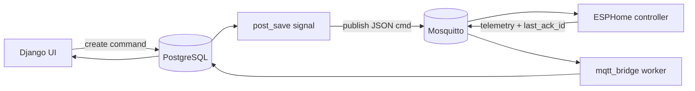

# Sauna Controller

ESPHome-based sauna controller for ESP32-S3, integrated with Home Assistant and MQTT.

Designed for slow thermal inertia systems (sauna cabins), with conservative safety behavior, time-proportional heater actuation, and online thermal/ETA learning.

The project runs as a complete stack:

- ESPHome firmware on the controller
- Mosquitto broker with optional/public TLS listener
- Django web UI for control and diagnostics
- MQTT worker that ingests telemetry and reconciles command ACK state

## Quick Start (First-Time Setup)

1. Prepare local secrets and environment files:
	- Create/populate `.env` for Docker services (DB, Django, MQTT worker).
	- Create/populate `secrets.yaml` for ESPHome (Wi-Fi, API key, OTA, MQTT, `mqtt_ca_cert`).

2. Set MQTT password file for Mosquitto:

```bash
docker run --rm -v "$PWD/mqtt/config:/mosquitto/config" eclipse-mosquitto:2 \
  sh -c 'mosquitto_passwd -b /mosquitto/config/passwd sauna_mqtt "CHANGE_ME_STRONG_PASSWORD"'
```

3. Sync broker TLS certificate from Caddy (adjust domain):

```bash
sudo ./mqtt/sync_caddy_cert.sh sauna.sysio.cloud
```

4. Start full stack:

```bash
docker compose up -d --build
docker compose ps
```

5. Validate firmware config/build:

```bash
./esphome.sh config sauna-controller.yaml
./esphome.sh compile sauna-controller.yaml
```

6. Open UI and sign in:
	- `http://127.0.0.1:8000`
	- Create/manage devices in Django admin (`/admin`) and monitor dashboard at `/`.

7. Optional smoke checks:

```bash
docker compose logs --tail=120 web mqtt mqtt_worker
docker compose exec -T web python manage.py test core
```

## Short project overview

- ESPHome-based sauna controller
- ESP32-S3 target (esp-idf)
- Home Assistant entities + encrypted API
- MQTT command/telemetry plane with TLS support
- Suitable for off-grid deployments (for example Victron-based systems) where stable, relay-friendly control is required
- Tuned for high thermal inertia behavior

## Features

Implemented in current codebase:

- PID temperature control using ESPHome climate PID
- Windowed heater control (time-proportional ON/OFF) with minimum ON/OFF constraints
- Multi-sensor DS18B20 architecture (top, head, under-bench, outdoor)
- Online thermal model estimation (UA, thermal capacity, time constant)
- ETA prediction from online linear regression with auto-calibration
- Hard safety logic (overtemperature cut-off, sensor watchdog, forced heater shutdown)
- Session limits with automatic climate OFF after max session duration
- Boost mode with entry/exit thresholds and timeout
- Fan destratification hysteresis logic
- Runtime and energy statistics (integrated from modeled power)
- MQTT JSON command interface with command IDs and ACK tracking
- Home Assistant entities for control, diagnostics, and maintenance actions
- Outdoor temperature compensation in ETA model and heat-loss calculations
- Sensor fault handling with graceful HA state synchronization
- OTA firmware updates
- Recovery-oriented behavior on boot/reconnect (safe startup state, no auto-reboot on network/API timeout)

## Hardware

### Implemented target

| Component | Current implementation |
| --- | --- |
| MCU | ESP32-S3 DevKitC-1 |
| Framework | ESP-IDF via ESPHome |
| Main temperature sensors | DS18B20 (4 independent 1-Wire buses) |
| Heater drive output | GPIO15 (inverted), exposed as internal contactor output |
| Fan output | GPIO16 (inverted) |
| Light output | GPIO17 (inverted) |
| Amplifier output | GPIO18 (inverted) |

### DS18B20 topology

The firmware uses one dedicated GPIO per DS18B20 channel:

- Top: GPIO4
- Head: GPIO5
- Under-bench: GPIO6
- Outdoor: GPIO7

This avoids bus-level ambiguity and simplifies fault isolation.

### Heater control architecture

- Current implementation is relay/contactor style ON/OFF windowing
- Nominal heater power is modeled as 6 kW (informational/modeling value)
- Control output is not analog modulation; it is duty scheduling in fixed windows

### Recommended power switching and protection

The current firmware supports contactor-style control directly. For long-term reliability and smoother modulation, a zero-cross SSR architecture is recommended.

Recommended practical hardware protections:

- Independent high-limit thermal cutout in heater power path
- Proper MCB/RCD and enclosure earthing
- Contactor/SSR sized for resistive load and ambient temperature
- Surge protection and correct low-voltage isolation
- Interlock contact feedback (if available) for future closed-loop power confirmation

### Victron off-grid compatibility

No direct Victron protocol integration is implemented in code.

Compatibility is electrical/operational:

- Works as a thermostatic high-power load controller
- Runtime and estimated energy data can support external energy planning
- Conservative ON/OFF windowing is suitable for inverter-backed systems with thermal inertia

## Software Architecture

### System components

| Component | Role |
| --- | --- |
| sauna-controller.yaml | Firmware logic (control loop, safety, telemetry, command handling) |
| Mosquitto | MQTT broker (auth, 1883 + TLS 8883 listeners) |
| Django web app | UI, auth, command creation, diagnostics API |
| MQTT worker | Telemetry ingestion and command ACK reconciliation |
| PostgreSQL | Persistent storage for devices, telemetry, commands |

### End-to-end flow



### ESPHome structure and control loop

- Climate PID writes duty request 0..1 into internal variable
- A 1-second main loop is the single source of truth for:
	- hard safety decisions
	- session enforcement
	- boost state transitions
	- windowed heater actuation
	- fan hysteresis
	- runtime counters
	- ETA/thermal model learning
- A separate 20-second interval publishes telemetry snapshot JSON

### PID behavior in current firmware

Current controller values in firmware:

- kp: 0.02
- ki: 0.0002
- kd: 0.01
- deadband: +0.3 / -0.3 degC

These values are currently tuned for slow relay-window operation, not fast analog modulation.

### Windowing logic

- Window length: 180 s
- Minimum ON pulse: 45 s
- Minimum OFF pulse: 45 s
- PID duty is converted to ON time per window, then latched for that full window
- Boost can force immediate full-window ON without waiting for rollover

### Thermal model and ETA learning

- Firmware performs online ETA regression and thermal-parameter learning during runtime.
- Published diagnostics include ETA, confidence/RMSE, UA, thermal capacity, and time constant.
- Detailed formulas, sampling gates, and learning constraints are documented in [docs/MODELING.md](docs/MODELING.md).

### MQTT integration

- Firmware consumes JSON commands on sauna/device_id/cmd
- Firmware publishes telemetry JSON on sauna/device_id/telemetry every 20 s
- Firmware publishes birth/will state to sauna/device_id/state
- Django worker subscribes to sauna/+/telemetry and writes telemetry rows

### Home Assistant interaction

- ESPHome API is enabled with encryption key
- Entities are exposed by ESPHome (climate, sensors, switches, lights, numbers, select, buttons, diagnostics)
- The Django UI is complementary and MQTT-centric; it does not replace HA native entity model

## Temperature Sensors

| Sensor | Purpose | Used by control loop |
| --- | --- | --- |
| Top | Safety overtemperature reference and one control candidate | Yes |
| Head | Main comfort/control candidate | Yes |
| Under-bench | Stratification measurement | Indirect (fan logic) |
| Outdoor | Environmental compensation and thermal/ETA modeling | Yes |

### Control source selection

The control temperature is selectable through a config select entity:

- Average (Top+Head) (default)
- Top
- Head

Validation behavior:

- If selected source is invalid, control temperature becomes NaN
- Heater is disabled by safety/watchdog logic when critical sensor validity is lost

## Heater Control Strategy

### Implemented behavior

1. PID computes requested duty fraction.
2. Main loop converts duty to ON-time in a fixed control window.
3. Minimum ON/OFF limits are enforced.
4. Output is applied as binary command to heater contactor output.

This is time-proportional control (not phase-angle or true analog power control).

### Contactor vs SSR guidance

- Current firmware defaults are contactor-friendly.
- For higher resolution and reduced mechanical wear, migrate to zero-cross SSR switching with shorter windows.

Why zero-cross SSR is preferred:

- Lower electrical stress and EMI on resistive heaters
- Cleaner current transitions around AC zero crossing
- Better compatibility with time-proportional burst firing

Why phase-angle dimming is avoided:

- Higher EMI/harmonics
- Not needed for high-inertia resistive sauna loads
- Adds complexity and regulatory considerations not present in current implementation

## Thermal Model / ETA

Summary:

- Self-learning ETA and thermal model are active in firmware.
- Learning is paused during sensor-fault/invalid-input conditions.
- Outdoor temperature is used for ETA compensation and heat-loss estimation.

For implementation-level details (equations, sampling thresholds, clamping, and confidence scoring), see [docs/MODELING.md](docs/MODELING.md).

## MQTT

### Topics

| Direction | Topic |
| --- | --- |
| Telemetry | sauna/<device_id>/telemetry |
| Commands | sauna/<device_id>/cmd |
| Online/offline state | sauna/<device_id>/state |

### Command JSON format

~~~json
{
	"cmd_id": 123,
	"type": "set_climate",
	"payload": {
		"mode": "HEAT",
		"setpoint_c": 85
	},
	"ts": 1760000000
}
~~~

Supported command types in firmware:

- set_climate
- set_fan
- set_light
- set_amp
- set_number
- set_select
- press_button

### Telemetry behavior

- Published every 20 seconds
- Includes temperatures, mode, setpoint, power/energy/runtime counters
- Includes model diagnostics (ETA, confidence, UA/C/tau)
- Includes last_ack_id for command reconciliation

### Security recommendations

- Use MQTT authentication (already configured)
- Prefer TLS listener 8883 for external/public connectivity
- Keep non-TLS listener restricted to trusted/internal network scopes
- Maintain certificate lifecycle using mqtt/sync_caddy_cert.sh

Important:

- Secrets and password files must never be committed to GitHub
- Use local secrets.yaml and environment-driven .env for credentials and keys
- Keep mqtt/config/passwd and mqtt/certs/*.key local-only

## Home Assistant Integration

Implemented via ESPHome API + entity model:

- Climate: Sauna Climate (HEAT/OFF, target temperature)
- Sensors: all temperatures, control temperature, stratification, power/energy, ETA/thermal diagnostics, runtime counters
- Diagnostics: sensor fault, control validity, confidence metrics, model sample counts
- Controls: fan/light/amplifier switches, heater state exposure, emergency OFF through climate command path
- Select/number/button entities:
	- control temp source select
	- boost/session/fan parameters
	- reset and restart maintenance buttons

Runtime statistics are available both as HA entities and through MQTT telemetry consumed by the Django UI.

## Safety Features

Implemented protections:

- Overtemperature shutdown: immediate heater kill if top sensor exceeds 120 degC
- Sensor validation watchdog:
	- rejects invalid DS18B20 values (NaN, 85 default, -127-style faults, implausible ranges)
	- requires recent valid readings (timeout 15 s)
- Session timeout: max session duration forces climate OFF and heater OFF
- Startup-safe state: outputs OFF and climate OFF on boot
- Failsafe heater shutdown on any critical fault path
- Sensor fault to HA state synchronization: climate can be forced OFF after grace period to avoid false HEAT indication

Watchdog/recovery note:

- There is no dedicated hardware watchdog policy in YAML for autonomous reboot loops
- Instead, safety is handled by deterministic heater-off logic and conservative state forcing

## Recommended PID Values

Practical starting points for a slow sauna system (approximately 1 degC/min heating rate):

| Output hardware | Suggested starting PID | Windowing guidance | Expected behavior |
| --- | --- | --- | --- |
| Mechanical contactor | kp 0.02, ki 0.0002, kd 0.01 | 120-240 s windows, min ON/OFF >= 30-45 s | Low chatter, gradual approach, less overshoot control authority |
| Zero-cross SSR (recommended migration) | kp 0.10-0.25, ki 0.001-0.005, kd 5-25 | 5-20 s windows, short burst-firing intervals | Smoother modulation, tighter setpoint tracking |

Notes:

- The first row matches current firmware philosophy.
- The SSR row is operational guidance for future tuning, not currently implemented defaults.
- Final values depend on heater power, cabin volume, airflow, and sensor placement.

## Repository Structure

| Path | Purpose |
| --- | --- |
| sauna-controller.yaml | Main ESPHome firmware and control logic |
| docker-compose.yml | PostgreSQL + Mosquitto + Django web + MQTT worker services |
| mqtt/config/mosquitto.conf | Broker listeners, auth, TLS settings |
| mqtt/sync_caddy_cert.sh | Sync TLS cert/key from Caddy storage to broker cert folder |
| web/ | Django application (UI, APIs, models, MQTT bridge) |
| web/core/mqtt_bridge.py | MQTT publish/ingest logic and ACK reconciliation helpers |
| web/core/management/commands/mqtt_bridge.py | Long-running telemetry consumer process |
| esphome.sh | ESPHome helper wrapper around local virtual environment |
| docs/MODELING.md | Advanced ETA and thermal-model implementation details |
| ESPHOME_SETUP.md | ESPHome environment and workflow notes |
| DEPLOYMENT.md | Deployment/TLS checklist |

## Future Improvements

Roadmap directions implied by current implementation:

- Full migration to SSR-oriented power modulation profile
- Better adaptive thermal model robustness (conditioning, richer state terms)
- Dynamic PID tuning based on operating region and model confidence
- Improved modulation strategy at low demanded power
- Better ETA learning robustness near setpoint and during disturbance events
- Extended dashboard/telemetry analytics (longer trend views, alerts, model quality tracking)
